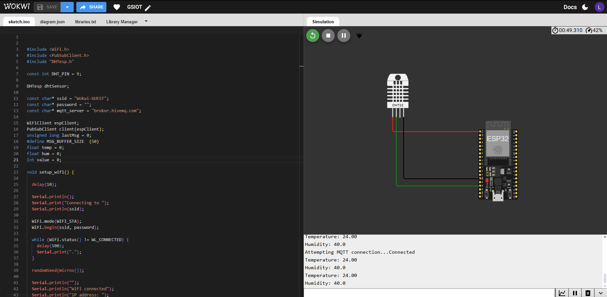

# Monitoramento de Temperatura e Umidade com MQTT e Sensor DHT22
Julia Amorim - RM99609
Lana Leite - RM551143
Matheus Cavasini - RM97722

## 📘 Descrição do Projeto

Este projeto tem como objetivo monitorar a **temperatura** e a **umidade do ambiente** utilizando o **sensor DHT22** conectado a um **ESP32**.  
Os dados coletados são enviados, em tempo real, para um **servidor MQTT**, possibilitando a comunicação entre dispositivos IoT e a visualização remota das medições.

O projeto foi desenvolvido e simulado na plataforma **Wokwi**, com foco em demonstrar a importância da automação e do uso de sensores inteligentes no **futuro do trabalho**, especialmente em áreas que exigem controle ambiental, como laboratórios, escritórios inteligentes e indústrias.

---

## 💡 Problema e Importância

No contexto do **futuro do trabalho**, o monitoramento de ambientes é essencial para garantir **conforto, segurança e eficiência energética**.  
Temperaturas inadequadas e alta umidade podem comprometer tanto o desempenho de equipamentos quanto a produtividade e o bem-estar de colaboradores.

Assim, o projeto propõe uma **solução automatizada e conectada**, capaz de fornecer dados ambientais em tempo real via MQTT — protocolo amplamente utilizado na Internet das Coisas (IoT).

---

## ⚙️ Solução Desenvolvida

A solução utiliza um **ESP32** conectado a um **sensor DHT22** para capturar temperatura e umidade.  
Essas informações são enviadas para um **broker MQTT público** (`broker.hivemq.com`) que atua como intermediário entre o dispositivo e o sistema de monitoramento.

A cada **2 segundos**, o ESP32 lê os valores do sensor e publica nos seguintes tópicos MQTT:
- `iotfrontier/temperature` → temperatura em °C  
- `iotfrontier/humidity` → umidade relativa do ar em %

---

## 🧠 Funcionamento do Código

O código conecta o ESP32 à rede Wi-Fi do **Wokwi**, inicializa o sensor DHT22 e estabelece comunicação com o servidor MQTT.

Em seguida:
1. O dispositivo coleta temperatura e umidade.  
2. Envia esses valores para o broker MQTT.  
3. Exibe as informações no **Monitor Serial**.

---

## 🔧 Dependências

O projeto utiliza as seguintes bibliotecas:

- **WiFi.h** → Conexão com a rede Wi-Fi  
- **PubSubClient.h** → Comunicação via protocolo MQTT  
- **DHTesp.h** → Leitura do sensor DHT22  

Essas bibliotecas já estão disponíveis na IDE do Arduino e no ambiente do Wokwi.

---

## 💻 Instruções de Uso

1. Acesse o projeto no **Wokwi** pelo link abaixo:  
   👉 [Projeto Wokwi - Monitoramento de Temperatura e Umidade](https://wokwi.com/projects/447447760615047169)

2. Clique em **"Start Simulation"** para iniciar a simulação.  
3. Abra o **Serial Monitor** (ícone no canto inferior direito).  
4. Observe as leituras de temperatura e umidade sendo enviadas e publicadas nos tópicos MQTT.

---

## 📸 Imagens do Circuito

### Montagem no Wokwi

Componentes utilizados:
- ESP32 DevKit
- Sensor DHT22 (pino de dados conectado ao GPIO 9)
- Fonte de alimentação simulada no Wokwi

---

## 🌐 Explicação sobre MQTT

O **MQTT (Message Queuing Telemetry Transport)** é um **protocolo de comunicação leve**, ideal para sistemas de IoT.  
Ele segue o modelo **publicador/assinante (publish/subscribe)**:

- **Broker:** servidor central que gerencia as mensagens (neste projeto, `broker.hivemq.com`).  
- **Publisher:** o ESP32, que envia os dados coletados.  
- **Subscriber:** qualquer aplicativo ou dashboard que receba as informações.

### Tópicos Utilizados
- `iotfrontier/temperature` → publica a temperatura em tempo real  
- `iotfrontier/humidity` → publica a umidade em tempo real  

Os dados podem ser visualizados em plataformas MQTT como **MQTT Explorer**, **Node-RED** ou **HiveMQ Web Client**.

---

## 📈 Resultados Esperados e Impacto

Com o monitoramento constante das variáveis ambientais, espera-se:

- **Aprimorar o controle de temperatura e umidade** em espaços de trabalho.  
- **Automatizar decisões**, como ativação de ventilação ou refrigeração.  
- **Integrar sensores e dashboards** para análises em tempo real.

Essa solução representa um **exemplo prático do uso da IoT no futuro do trabalho**, combinando **tecnologia, eficiência e bem-estar humano**.

---

## 🧩 Autor

**Lana Leite**  
Engenharia de Software – FIAP  
Projeto desenvolvido para a disciplina de IoT e Automação no contexto do Futuro do Trabalho.
